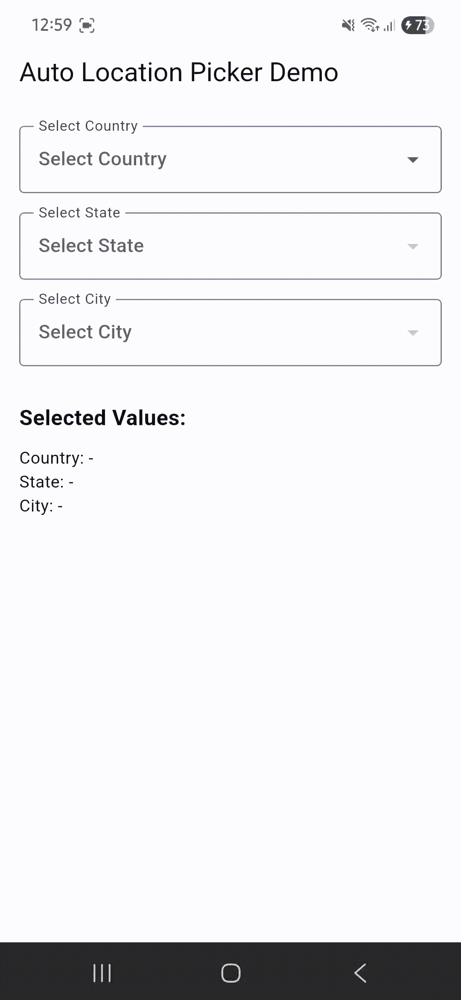

# Flutter Auto Location Picker

A reusable Flutter package for selecting Country, State, and City with ease. It provides linked dropdowns that automatically update based on the parent selection, supporting custom data sources and Material 3 design.

---
## When To Use

Use `LocationPicker` when you need:

* Registration or Profile forms requiring address details.
* Shipping and billing address selection.
* Filtering content based on location (Country -> State -> City).
* A clean, linked dropdown system with minimal boilerplate.
* Custom location data via JSON.

This package helps reduce repetitive location management code and provides a reliable solution for handling hierarchical geographical data in Flutter applications.

## Perfect For

✅ E-commerce Apps
✅ Service Booking Platforms
✅ Social Media Profiles
✅ Directory & Listing Apps
✅ Fast Flutter Development
✅ Reusable Form Components

## Features

| Feature                | Supported |
| ---------------------- | --------- |
| Linked Dropdowns       | ✅         |
| Material 3 Compatible  | ✅         |
| Custom JSON Support    | ✅         |
| Form Validation        | ✅         |
| Initial Value Support  | ✅         |
| Alphabetical Sorting   | ✅         |
| Custom Decorations     | ✅         |

---
## Parameters for `LocationPicker`

| Parameter          | Type                         | Default | Description                                            |
| ------------------ | ---------------------------- | ------- | ------------------------------------------------------ |
| onCountryChanged   | ValueChanged<String>?        | null    | Callback when country changes                          |
| onStateChanged     | ValueChanged<String>?        | null    | Callback when state changes                            |
| onCityChanged      | ValueChanged<String>?        | null    | Callback when city changes                             |
| countryHint        | String?                      | null    | Hint text for country dropdown                         |
| stateHint          | String?                      | null    | Hint text for state dropdown                           |
| cityHint           | String?                      | null    | Hint text for city dropdown                            |
| initialCountry     | String?                      | null    | Initial country name to select                         |
| initialState       | String?                      | null    | Initial state name to select                           |
| initialCity        | String?                      | null    | Initial city name to select                            |
| enabled            | bool                         | true    | Whether the picker is enabled                          |
| decoration         | InputDecoration?             | null    | Custom decoration for all dropdowns                    |
| jsonPath           | String?                      | null    | Custom path to location JSON file                      |
| countryValidator   | FormFieldValidator<String>?  | null    | Validator for country dropdown                         |
| stateValidator     | FormFieldValidator<String>?  | null    | Validator for state dropdown                           |
| cityValidator      | FormFieldValidator<String>?  | null    | Validator for city dropdown                            |
| loadingWidget      | Widget?                      | null    | Custom widget to show during initialization            |
| showSearch         | bool                         | false   | Whether to show search functionality                  |
| searchHint         | String?                      | null    | Hint text for the search field                        |

---

# Installation

Add dependency in `pubspec.yaml`

```yaml
dependencies:
  library_flutter_auto_location_picker:
    git:
      url: https://github.com/Excelsior-Technologies-Community/library_flutter_auto_location_picker.git
```

---

# Import

```dart
import 'package:library_flutter_auto_location_picker/library_flutter_auto_location_picker.dart';
```

---

# Initialization

The package handles initialization internally when the `LocationPicker` is first used, but you can also manually initialize the data:

```dart
void main() async {
  WidgetsFlutterBinding.ensureInitialized();
  await LocationService.initialize();
  runApp(const MyApp());
}
```

---

# Usage Examples

## Basic Location Picker
```dart
LocationPicker(
  countryHint: "Select Country",
  stateHint: "Select State",
  cityHint: "Select City",
  onCountryChanged: (value) => print(value),
  onStateChanged: (value) => print(value),
  onCityChanged: (value) => print(value),
)
```

---

# Full Example

Here is a complete implementation showing how to use `LocationPicker` in a Flutter UI.

```dart
import 'package:flutter/material.dart';
import 'package:library_flutter_auto_location_picker/library_flutter_auto_location_picker.dart';

void main() {
  runApp(const MaterialApp(home: LocationPickerExample()));
}

class LocationPickerExample extends StatefulWidget {
  const LocationPickerExample({super.key});

  @override
  State<LocationPickerExample> createState() => _LocationPickerExampleState();
}

class _LocationPickerExampleState extends State<LocationPickerExample> {
  String? country;
  String? state;
  String? city;

  @override
  Widget build(BuildContext context) {
    return Scaffold(
      appBar: AppBar(title: const Text("Location Picker Example")),
      body: Padding(
        padding: const EdgeInsets.all(16.0),
        child: Column(
          children: [
            LocationPicker(
              countryHint: "Select Country",
              stateHint: "Select State",
              cityHint: "Select City",
              jsonPath: "location.json",
              initialCountry: "India",
              decoration: const InputDecoration(
                border: OutlineInputBorder()
              ),

              onCountryChanged: (value) {
                setState(() {
                  country = value;
                });
              },

              onStateChanged: (value) {
                setState(() {
                  state = value;
                });
              },

              onCityChanged: (value) {
                setState(() {
                  city = value;
                });
              },
            ),
            const SizedBox(height: 32),
            Text("Selected Country: $country"),
            Text("Selected State: $state"),
            Text("Selected City: $city"),
          ],
        ),
      ),
    );
  }
}
```

---
## Demo
Default locations with by default json file


Default locations with by user defined location json file


---
## License

MIT License

Copyright (c) 2026 Excelsior Technologies

Permission is hereby granted, free of charge, to any person obtaining a copy
of this software and associated documentation files (the "Software"), to deal
in the Software without restriction, including without limitation the rights
to use, copy, modify, merge, publish, distribute, sublicense, and/or sell
copies of the Software, and to permit persons to whom the Software is
furnished to do so, subject to the following conditions:

The above copyright notice and this permission notice shall be included in all
copies or substantial portions of the Software.

THE SOFTWARE IS PROVIDED "AS IS", WITHOUT WARRANTY OF ANY KIND, EXPRESS OR
IMPLIED, INCLUDING BUT NOT LIMITED TO THE WARRANTIES OF MERCHANTABILITY,
FITNESS FOR A PARTICULAR PURPOSE AND NONINFRINGEMENT. IN NO EVENT SHALL THE
AUTHORS OR COPYRIGHT HOLDERS BE LIABLE FOR ANY CLAIM, DAMAGES OR OTHER
LIABILITY, WHETHER IN AN ACTION OF CONTRACT, TORT OR OTHERWISE, ARISING FROM,
OUT OF OR IN CONNECTION WITH THE SOFTWARE OR THE USE OR OTHER DEALINGS IN THE
SOFTWARE.
